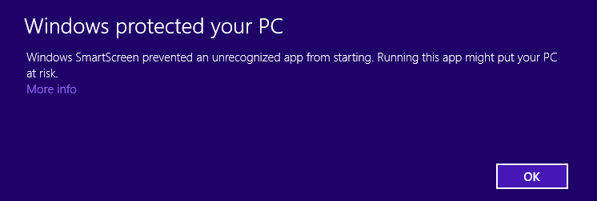
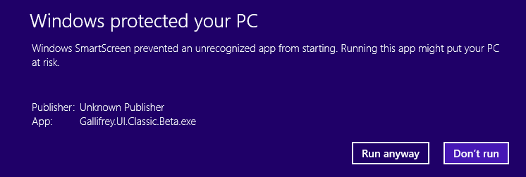

# SmartScreen Help

Windows 8 SmartScreen seems to be causing users some bother.  In the interim (until we have our own Microsoft approved certificate) the following steps will help!

When prompted with this:

Press the "More info" text

When prompted with this:

Press the "Run anyway" text

If you had Gallifrey pinned, you will need to un-pin & re-pin.
